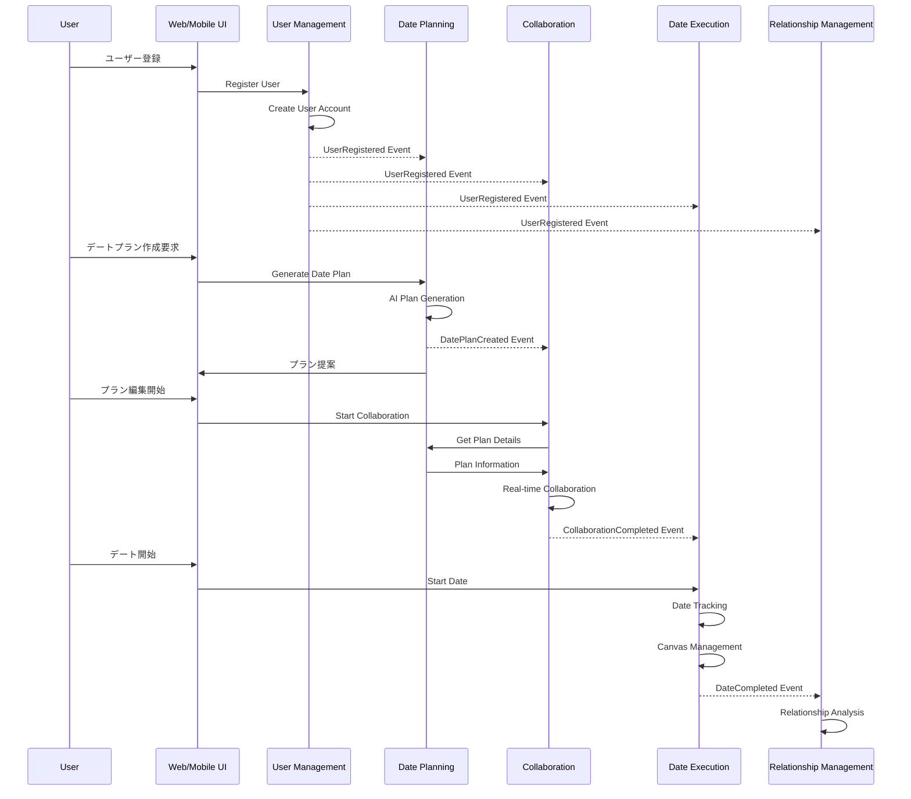

# CouplePlan マイクロサービス コンテキストマップ

## 概要

CouplePlanプラットフォームの8つのマイクロサービス間の関係性を、ドメイン駆動設計（DDD）のコンテキストマップとして図式化しています。各サービスは明確な責務を持ち、適切な統合パターンで連携しています。

## コンテキストマップ図

```mermaid
graph TB
    %% 外部システム
    subgraph "External Systems"
        EXT_AUTH[External Auth<br/>Supabase Auth]
        EXT_AI[AI Services<br/>OpenAI API]
        EXT_PAY[Payment<br/>Stripe API]
        EXT_MAP[Location<br/>MapBox API]
        EXT_REST[Restaurants<br/>External APIs]
    end

    %% ユーザーインターフェース層
    subgraph "User Interface Layer"
        WEB_PORTAL[Web Portal<br/>Next.js]
        MOBILE_APP[Mobile App<br/>PWA]
        ADMIN_PANEL[Admin Panel<br/>Management UI]
    end

    %% マイクロサービス層
    subgraph "Microservices Layer"
        %% コアドメインサービス
        subgraph "Core Domain Services"
            MS001[MS-001: User Management Service<br/>🔐 Authentication & Authorization<br/>👥 User & Couple Management]
            MS002[MS-002: Date Planning Service<br/>🤖 AI Plan Generation<br/>📋 Template Management]
            MS003[MS-003: Collaboration Service<br/>👥 Real-time Collaboration<br/>⚡ Conflict Resolution]
            MS004[MS-004: Relationship Management Service<br/>💕 Relationship Analysis<br/>🤝 Conflict Mediation]
        end

        %% 支援ドメインサービス
        subgraph "Supporting Domain Services"
            MS007[MS-007: Platform Integration Service<br/>🔗 Portal Integration<br/>🌐 External Service Integration]
            MS008[MS-008: Monetization Service<br/>💰 Subscription Management<br/>🚩 Feature Flag Control]
        end
    end

    %% データ層
    subgraph "Data Layer"
        DB_AUTH[(Auth Database<br/>Supabase Auth)]
        DB_CORE[(Core Database<br/>PostgreSQL)]
        DB_CACHE[(Cache Layer<br/>Redis)]
        DB_STORAGE[(File Storage<br/>Supabase Storage)]
        DB_ANALYTICS[(Analytics DB<br/>PostgreSQL)]
    end

    %% インフラストラクチャ層
    subgraph "Infrastructure Layer"
        API_GATEWAY[API Gateway<br/>Vercel Edge]
        EVENT_BUS[Event Bus<br/>Supabase Realtime]
        CDN[CDN<br/>Vercel Edge Network]
        MONITORING[Monitoring<br/>Vercel Analytics]
    end

    %% ユーザーインターフェース → マイクロサービス
    WEB_PORTAL --> MS007
    WEB_PORTAL --> MS001
    MOBILE_APP --> MS001
    MOBILE_APP --> MS002
    MOBILE_APP --> MS003
    MOBILE_APP --> MS004
    MOBILE_APP --> MS005
    ADMIN_PANEL --> MS008

    %% マイクロサービス間の関係性
    %% Published Language (PL) - イベント配信
    MS001 -.->|UserRegistered<br/>CoupleFormed| MS002
    MS001 -.->|UserRegistered<br/>CoupleFormed| MS003
    MS001 -.->|UserRegistered<br/>CoupleFormed| MS004
    MS001 -.->|UserRegistered<br/>CoupleFormed| MS005
    MS001 -.->|UserRegistered<br/>CoupleFormed| MS008

    MS002 -.->|DatePlanCreated| MS003
    MS003 -.->|CollaborationCompleted| MS004
    MS004 -.->|DateCompleted| MS005

    %% Customer-Supplier (CS) - 直接呼び出し
    MS003 -->|Plan Request| MS002
    MS004 -->|Session Info| MS003
    MS005 -->|Relationship Data| MS001

    %% Open Host Service (OHS) - 統合API
    MS007 -->|Integration API| MS001
    MS007 -->|Integration API| MS002
    MS007 -->|Integration API| MS003
    MS007 -->|Integration API| MS004
    MS007 -->|Integration API| MS005

    %% Published Language (PL) - 機能制御
    MS008 -.->|FeatureUnlocked<br/>SubscriptionActivated| MS001
    MS008 -.->|FeatureUnlocked<br/>SubscriptionActivated| MS002
    MS008 -.->|FeatureUnlocked<br/>SubscriptionActivated| MS003
    MS008 -.->|FeatureUnlocked<br/>SubscriptionActivated| MS004
    MS008 -.->|FeatureUnlocked<br/>SubscriptionActivated| MS005

    %% 外部システム統合
    MS001 <--> EXT_AUTH
    MS002 <--> EXT_AI
    MS004 <--> EXT_MAP
    MS007 <--> EXT_REST
    MS008 <--> EXT_PAY

    %% データアクセス
    MS001 --> DB_AUTH
    MS001 --> DB_CORE
    MS002 --> DB_CORE
    MS002 --> DB_CACHE
    MS003 --> DB_CACHE
    MS003 --> DB_CORE
    MS004 --> DB_CORE
    MS004 --> DB_STORAGE
    MS005 --> DB_CORE
    MS005 --> DB_ANALYTICS
    MS007 --> DB_CORE
    MS008 --> DB_CORE
    MS008 --> DB_CACHE

    %% インフラストラクチャ統合
    API_GATEWAY --> MS001
    API_GATEWAY --> MS002
    API_GATEWAY --> MS003
    API_GATEWAY --> MS004
    API_GATEWAY --> MS005
    API_GATEWAY --> MS007
    API_GATEWAY --> MS008

    EVENT_BUS -.-> MS001
    EVENT_BUS -.-> MS002
    EVENT_BUS -.-> MS003
    EVENT_BUS -.-> MS004
    EVENT_BUS -.-> MS005
    EVENT_BUS -.-> MS007
    EVENT_BUS -.-> MS008

    %% スタイリング
    classDef coreDomain fill:#e1f5fe,stroke:#01579b,stroke-width:2px
    classDef supportingDomain fill:#f3e5f5,stroke:#4a148c,stroke-width:2px
    classDef externalSystem fill:#fff3e0,stroke:#e65100,stroke-width:2px
    classDef dataLayer fill:#e8f5e8,stroke:#1b5e20,stroke-width:2px
    classDef infrastructure fill:#fce4ec,stroke:#880e4f,stroke-width:2px
    classDef uiLayer fill:#f1f8e9,stroke:#33691e,stroke-width:2px

    class MS001,MS002,MS003,MS004,MS005 coreDomain
    class MS007,MS008 supportingDomain
    class EXT_AUTH,EXT_AI,EXT_PAY,EXT_MAP,EXT_REST externalSystem
    class DB_AUTH,DB_CORE,DB_CACHE,DB_STORAGE,DB_ANALYTICS dataLayer
    class API_GATEWAY,EVENT_BUS,CDN,MONITORING infrastructure
    class WEB_PORTAL,MOBILE_APP,ADMIN_PANEL uiLayer
```

## 統合パターン詳細

### 1. Published Language (PL) - イベント駆動統合
**説明**: 非同期イベントによる疎結合な統合パターン

| イベント発行者 | イベント名 | イベント購読者 | 用途 |
|---|---|---|---|
| MS-001 | UserRegistered, CoupleFormed | MS-002, MS-003, MS-004, MS-008 | ユーザー状態同期 |
| MS-002 | DatePlanCreated | MS-003 | プラン編集開始 |
| MS-003 | CollaborationCompleted | MS-004 | デート実行準備 |
| MS-004 | DateCompleted | MS-004 | 関係性分析 |
| MS-008 | FeatureUnlocked, SubscriptionActivated | 全サービス | 機能制御 |

### 2. Customer-Supplier (CS) - 直接API呼び出し
**説明**: 上流サービスが下流サービスのAPIを直接呼び出す統合パターン

| 顧客サービス | 供給者サービス | 呼び出し内容 | 通信方式 |
|---|---|---|---|
| MS-003 | MS-002 | プラン情報取得 | REST API |
| MS-004 | MS-003 | セッション情報取得 | REST API |
| MS-004 | MS-001 | 関係性データ取得 | REST API |
| MS-006 | MS-004 | メモリ情報取得 | REST API |

### 3. Open Host Service (OHS) - 統合API提供
**説明**: MS-007が全サービスの統合APIを提供するパターン

| 統合機能 | 対象サービス | 提供API |
|---|---|---|
| ポータル統合 | MS-001, MS-002, MS-003, MS-004 | 統合エンドポイント |
| 外部サービス連携 | 全サービス | 外部API プロキシ |
| コンテンツ配信 | 全サービス | コンテンツ配信API |

## データフロー

### 主要なビジネスフロー

## 技術スタック

### 共通技術スタック
- **ランタイム**: Node.js (TypeScript)
- **デプロイ**: Vercel Serverless Functions
- **データベース**: Supabase (PostgreSQL)
- **キャッシュ**: Redis (Supabase)
- **ストレージ**: Supabase Storage
- **認証**: Supabase Auth
- **リアルタイム**: Supabase Realtime
- **監視**: Vercel Analytics

### サービス固有技術
- **MS-002**: Python, OpenAI API (AI処理)
- **MS-004**: Python, scikit-learn (機械学習)
- **MS-008**: Stripe API (決済処理)

## セキュリティ考慮事項

### 認証・認可
- **認証**: Supabase Auth (JWT)
- **認可**: RBAC (Role-Based Access Control)
- **API保護**: API Gateway + JWT検証

### データ保護
- **暗号化**: AES-256 (保存時), TLS 1.3 (通信時)
- **プライバシー**: PII匿名化、GDPR/APPI準拠
- **監査**: 全API呼び出しログ

### セキュリティ境界
- **外部API**: API Key管理、レート制限
- **内部通信**: サービス間認証、ネットワーク分離
- **データアクセス**: 最小権限の原則

## 運用・監視

### 可用性目標
- **SLO**: 99.9% (コアサービス), 99.5% (支援サービス)
- **RTO**: 1時間以内 (コアサービス), 4時間以内 (支援サービス)
- **RPO**: 15分以内 (コアサービス), 1時間以内 (支援サービス)

### 監視指標
- **可用性**: サービス稼働率、エラー率
- **パフォーマンス**: レスポンス時間、スループット
- **ビジネス**: ユーザーアクティブ率、収益指標

### 障害対応
- **自動復旧**: Circuit Breaker、リトライ機構
- **手動対応**: Runbook、エスカレーション手順
- **災害復旧**: マルチリージョン、バックアップ戦略

---

**作成日**: 2025年1月27日  
**バージョン**: 1.0  
**作成者**: ソフトウェアアーキテクト  
**承認者**: [承認者名]  
**レビュー者**: [レビュー者名]
