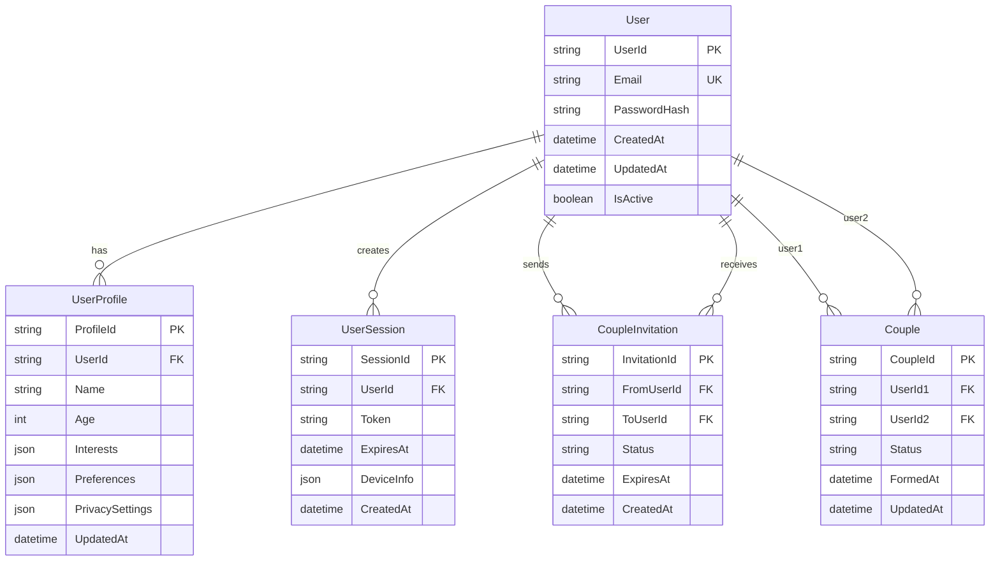
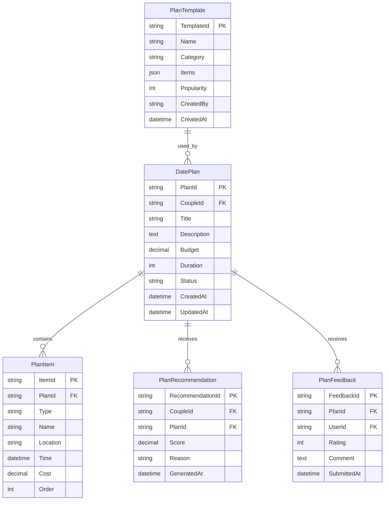
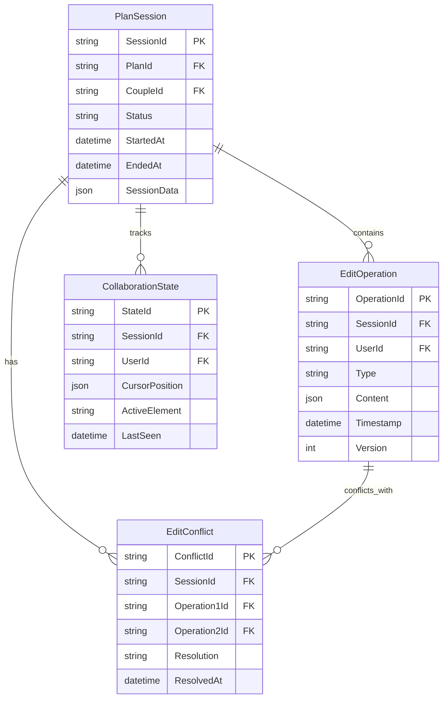
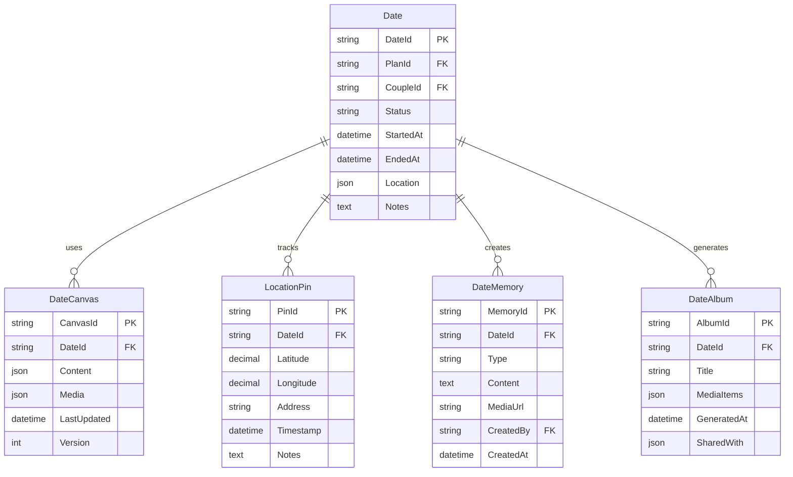
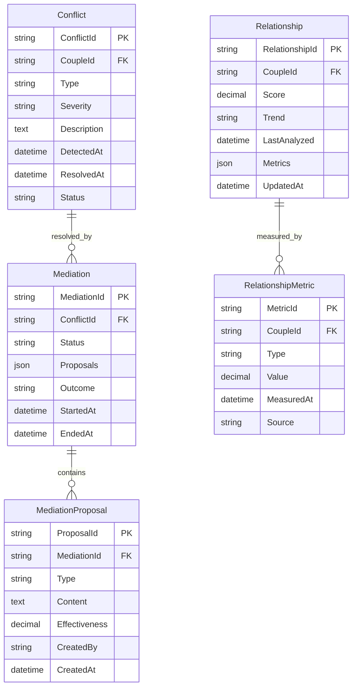
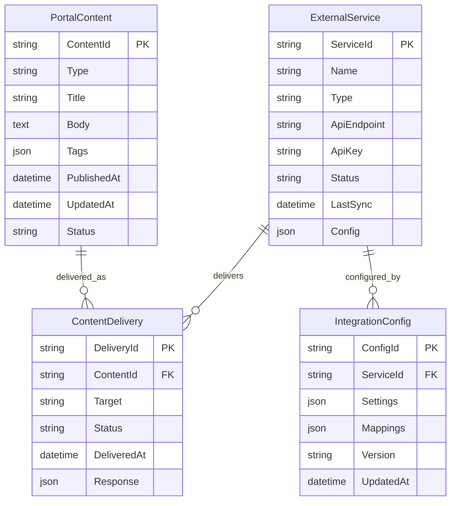
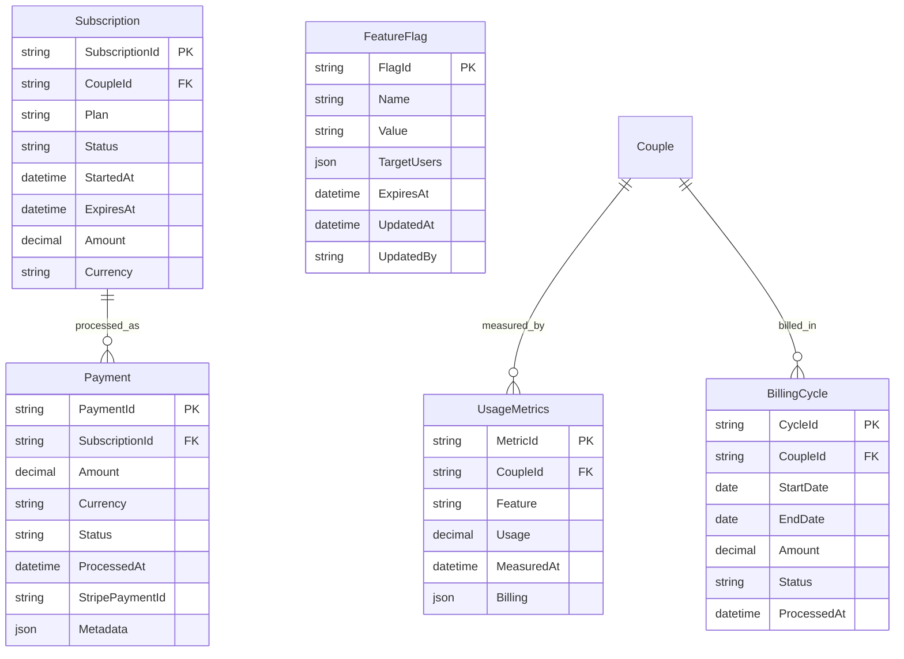

# CouplePlan マイクロサービス データモデル図

## 概要

CouplePlanプラットフォームの8つのマイクロサービスに分散配置された全エンティティのデータモデルを、Mermaid記法で図式化しています。各サービスは独自のデータストアを持ち、最終的整合性を前提とした設計となっています。

## 全体データモデル図

```mermaid
erDiagram
    %% MS-001: User Management Service
    User {
        string UserId PK
        string Email UK
        string PasswordHash
        datetime CreatedAt
        datetime UpdatedAt
        boolean IsActive
    }
    
    Couple {
        string CoupleId PK
        string UserId1 FK
        string UserId2 FK
        string Status
        datetime FormedAt
        datetime UpdatedAt
    }
    
    UserProfile {
        string ProfileId PK
        string UserId FK
        string Name
        int Age
        json Interests
        json Preferences
        json PrivacySettings
        datetime UpdatedAt
    }
    
    UserSession {
        string SessionId PK
        string UserId FK
        string Token
        datetime ExpiresAt
        json DeviceInfo
        datetime CreatedAt
    }
    
    CoupleInvitation {
        string InvitationId PK
        string FromUserId FK
        string ToUserId FK
        string Status
        datetime ExpiresAt
        datetime CreatedAt
    }

    %% MS-002: Date Planning Service
    DatePlan {
        string PlanId PK
        string CoupleId FK
        string Title
        text Description
        decimal Budget
        int Duration
        string Status
        datetime CreatedAt
        datetime UpdatedAt
    }
    
    PlanItem {
        string ItemId PK
        string PlanId FK
        string Type
        string Name
        string Location
        datetime Time
        decimal Cost
        int Order
    }
    
    PlanTemplate {
        string TemplateId PK
        string Name
        string Category
        json Items
        int Popularity
        string CreatedBy
        datetime CreatedAt
    }
    
    PlanRecommendation {
        string RecommendationId PK
        string CoupleId FK
        string PlanId FK
        decimal Score
        string Reason
        datetime GeneratedAt
    }
    
    PlanFeedback {
        string FeedbackId PK
        string PlanId FK
        string UserId FK
        int Rating
        text Comment
        datetime SubmittedAt
    }

    %% MS-003: Collaboration Service
    PlanSession {
        string SessionId PK
        string PlanId FK
        string CoupleId FK
        string Status
        datetime StartedAt
        datetime EndedAt
        json SessionData
    }
    
    EditOperation {
        string OperationId PK
        string SessionId FK
        string UserId FK
        string Type
        json Content
        datetime Timestamp
        int Version
    }
    
    EditConflict {
        string ConflictId PK
        string SessionId FK
        string Operation1Id FK
        string Operation2Id FK
        string Resolution
        datetime ResolvedAt
    }
    
    CollaborationState {
        string StateId PK
        string SessionId FK
        string UserId FK
        json CursorPosition
        string ActiveElement
        datetime LastSeen
    }

    %% MS-004: Date Execution Service
    Date {
        string DateId PK
        string PlanId FK
        string CoupleId FK
        string Status
        datetime StartedAt
        datetime EndedAt
        json Location
        text Notes
    }
    
    DateCanvas {
        string CanvasId PK
        string DateId FK
        json Content
        json Media
        datetime LastUpdated
        int Version
    }
    
    LocationPin {
        string PinId PK
        string DateId FK
        decimal Latitude
        decimal Longitude
        string Address
        datetime Timestamp
        text Notes
    }
    
    DateMemory {
        string MemoryId PK
        string DateId FK
        string Type
        text Content
        string MediaUrl
        string CreatedBy FK
        datetime CreatedAt
    }
    
    DateAlbum {
        string AlbumId PK
        string DateId FK
        string Title
        json MediaItems
        datetime GeneratedAt
        json SharedWith
    }

    %% MS-004: Relationship Management Service
    Relationship {
        string RelationshipId PK
        string CoupleId FK
        decimal Score
        string Trend
        datetime LastAnalyzed
        json Metrics
        datetime UpdatedAt
    }
    
    Conflict {
        string ConflictId PK
        string CoupleId FK
        string Type
        string Severity
        text Description
        datetime DetectedAt
        datetime ResolvedAt
        string Status
    }
    
    Mediation {
        string MediationId PK
        string ConflictId FK
        string Status
        json Proposals
        string Outcome
        datetime StartedAt
        datetime EndedAt
    }
    
    RelationshipMetric {
        string MetricId PK
        string CoupleId FK
        string Type
        decimal Value
        datetime MeasuredAt
        string Source
    }
    
    MediationProposal {
        string ProposalId PK
        string MediationId FK
        string Type
        text Content
        decimal Effectiveness
        string CreatedBy
        datetime CreatedAt
    }


    %% MS-007: Platform Integration Service
    PortalContent {
        string ContentId PK
        string Type
        string Title
        text Body
        json Tags
        datetime PublishedAt
        datetime UpdatedAt
        string Status
    }
    
    ExternalService {
        string ServiceId PK
        string Name
        string Type
        string ApiEndpoint
        string ApiKey
        string Status
        datetime LastSync
        json Config
    }
    
    IntegrationConfig {
        string ConfigId PK
        string ServiceId FK
        json Settings
        json Mappings
        string Version
        datetime UpdatedAt
    }
    
    ContentDelivery {
        string DeliveryId PK
        string ContentId FK
        string Target
        string Status
        datetime DeliveredAt
        json Response
    }

    %% MS-008: Monetization Service
    Subscription {
        string SubscriptionId PK
        string CoupleId FK
        string Plan
        string Status
        datetime StartedAt
        datetime ExpiresAt
        decimal Amount
        string Currency
    }
    
    Payment {
        string PaymentId PK
        string SubscriptionId FK
        decimal Amount
        string Currency
        string Status
        datetime ProcessedAt
        string StripePaymentId
        json Metadata
    }
    
    FeatureFlag {
        string FlagId PK
        string Name
        string Value
        json TargetUsers
        datetime ExpiresAt
        datetime UpdatedAt
        string UpdatedBy
    }
    
    UsageMetrics {
        string MetricId PK
        string CoupleId FK
        string Feature
        decimal Usage
        datetime MeasuredAt
        json Billing
    }
    
    BillingCycle {
        string CycleId PK
        string CoupleId FK
        date StartDate
        date EndDate
        decimal Amount
        string Status
        datetime ProcessedAt
    }

    %% 関係性定義
    %% MS-001 内部関係
    User ||--o{ UserProfile : "has"
    User ||--o{ UserSession : "creates"
    User ||--o{ CoupleInvitation : "sends"
    User ||--o{ CoupleInvitation : "receives"
    User ||--o{ Couple : "user1"
    User ||--o{ Couple : "user2"

    %% MS-002 内部関係
    Couple ||--o{ DatePlan : "creates"
    DatePlan ||--o{ PlanItem : "contains"
    DatePlan ||--o{ PlanRecommendation : "receives"
    DatePlan ||--o{ PlanFeedback : "receives"
    PlanTemplate ||--o{ DatePlan : "used_by"

    %% MS-003 内部関係
    DatePlan ||--o{ PlanSession : "edited_in"
    PlanSession ||--o{ EditOperation : "contains"
    PlanSession ||--o{ EditConflict : "has"
    PlanSession ||--o{ CollaborationState : "tracks"
    EditOperation ||--o{ EditConflict : "conflicts_with"

    %% MS-004 内部関係
    DatePlan ||--o{ Date : "executed_as"
    Date ||--o{ DateCanvas : "uses"
    Date ||--o{ LocationPin : "tracks"
    Date ||--o{ DateMemory : "creates"
    Date ||--o{ DateAlbum : "generates"

    %% MS-004 内部関係
    Couple ||--o{ Relationship : "has"
    Couple ||--o{ Conflict : "experiences"
    Couple ||--o{ RelationshipMetric : "measured_by"
    Conflict ||--o{ Mediation : "resolved_by"
    Mediation ||--o{ MediationProposal : "contains"


    %% MS-007 内部関係
    PortalContent ||--o{ ContentDelivery : "delivered_as"
    ExternalService ||--o{ IntegrationConfig : "configured_by"
    ExternalService ||--o{ ContentDelivery : "delivers"

    %% MS-008 内部関係
    Couple ||--o{ Subscription : "has"
    Subscription ||--o{ Payment : "processed_as"
    Couple ||--o{ UsageMetrics : "measured_by"
    Couple ||--o{ BillingCycle : "billed_in"

    %% サービス間関係（外部キー参照）
    %% MS-001 → 他サービス
    User ||--o{ PlanFeedback : "provides_feedback"
    User ||--o{ EditOperation : "performs"
    User ||--o{ DateMemory : "creates"
    User ||--o{ GratitudeMessage : "sends"
    User ||--o{ MediationProposal : "creates"

    %% MS-002 → 他サービス
    DatePlan ||--o{ PlanSession : "edited_in"
    DatePlan ||--o{ Date : "executed_as"

    %% MS-003 → 他サービス
    PlanSession ||--o{ EditOperation : "contains"

    %% MS-004 → 他サービス
    Date ||--o{ Memory : "generates"
    Date ||--o{ ExtractionLog : "logged_in"

    %% MS-004 → 他サービス
    Relationship ||--o{ PlanRecommendation : "influences"

    %% MS-006 → 他サービス
    Memory ||--o{ MemorySpark : "triggers"
```

## サービス別データモデル詳細

### MS-001: User Management Service

### MS-002: Date Planning Service

### MS-003: Collaboration Service

### MS-004: Date Execution Service

### MS-004: Relationship Management Service

### MS-007: Platform Integration Service

### MS-008: Monetization Service

## データ型・制約詳細

### 共通データ型
- **PK**: Primary Key（主キー）
- **FK**: Foreign Key（外部キー）
- **UK**: Unique Key（一意キー）
- **string**: 文字列（UUID形式）
- **text**: 長文テキスト
- **json**: JSON形式データ
- **decimal**: 小数点付き数値
- **datetime**: 日時
- **boolean**: 真偽値

### 重要な制約
1. **UserId**: 全サービス共通のユーザー識別子
2. **CoupleId**: カップル関係の一意識別子
3. **PlanId**: デートプランの一意識別子
4. **DateId**: デート実行の一意識別子
5. **SessionId**: 編集セッションの一意識別子

### 整合性レベル
- **強い整合性**: User, Couple, Subscription, Payment, Mediation
- **最終的整合性**: 分析データ、推奨データ、編集履歴、記録データ

---

**作成日**: 2025年1月27日  
**バージョン**: 1.0  
**作成者**: ソフトウェアアーキテクト  
**承認者**: [承認者名]  
**レビュー者**: [レビュー者名]
